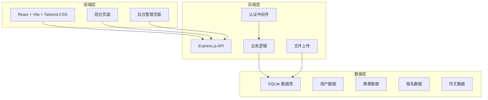
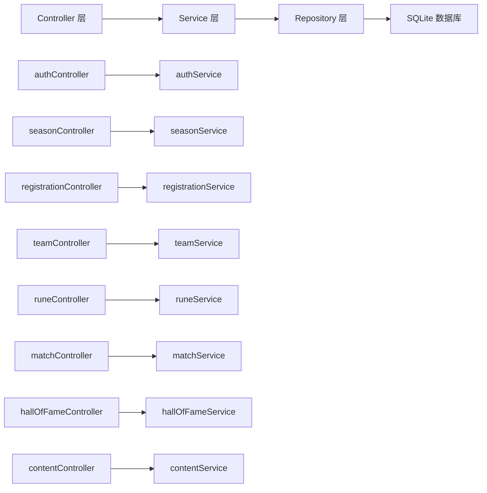
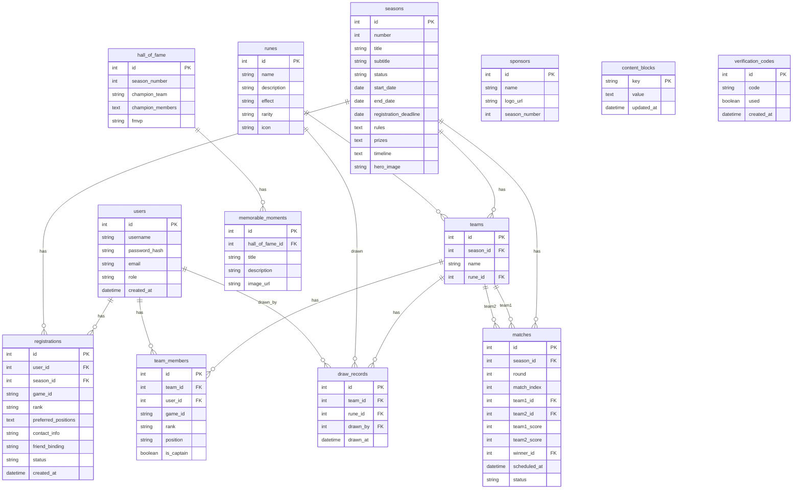

## 1. 架构设计



## 2. 技术说明

- **前端**：React@18 + TypeScript + Tailwind CSS + Vite
- **初始化工具**：vite-init（react-express-ts 模板）
- **后端**：Express@4 + TypeScript
- **数据库**：SQLite（轻量级、无需额外部署、易于备份）
- **ORM**：better-sqlite3 + 自定义数据访问层
- **认证**：JWT（JSON Web Token）
- **状态管理**：Zustand
- **动画**：Framer Motion
- **图标**：Lucide React

### 技术选型理由

| 技术 | 理由 |
|------|------|
| SQLite | 无需安装数据库服务、数据文件可直接备份、500人并发完全够用 |
| Express | 轻量灵活、社区成熟、适合中小型项目 |
| JWT | 无状态认证、简单可靠 |
| Zustand | 轻量级状态管理、API简洁 |
| Framer Motion | React动画库首选、抽卡动画实现简单 |

## 3. 路由定义

### 前台路由

| 路由 | 用途 |
|------|------|
| / | 首页 - S7赛季主题宣传 |
| /rules | 赛制公告 - 比赛规则与时间节点 |
| /register | 报名页 - 玩家报名表单 |
| /hexcard | 海克斯抽卡 - 抽卡动画与符文展示 |
| /hall-of-fame | 荣誉殿堂 - S1-S6回顾 |
| /schedule | 赛程与积分 - 对阵图与积分榜 |
| /login | 登录页 |
| /signup | 注册页 |
| /profile | 个人中心 - 个人信息与战队 |

### 后台路由

| 路由 | 用途 |
|------|------|
| /admin | 后台仪表盘 |
| /admin/seasons | 赛季管理 |
| /admin/registrations | 报名管理 |
| /admin/teams | 分队管理 |
| /admin/runes | 符文管理 |
| /admin/matches | 赛程管理 |
| /admin/content | 内容管理 |
| /admin/users | 用户管理 |

## 4. API 定义

### 4.1 认证相关

```typescript
// POST /api/auth/register
interface RegisterRequest {
  username: string;
  password: string;
  email?: string;
}
interface RegisterResponse {
  token: string;
  user: { id: number; username: string; role: string };
}

// POST /api/auth/login
interface LoginRequest {
  username: string;
  password: string;
}
interface LoginResponse {
  token: string;
  user: { id: number; username: string; role: string };
}

// GET /api/auth/me
interface MeResponse {
  id: number;
  username: string;
  role: string;
  registration?: Registration;
}
```

### 4.2 赛季相关

```typescript
// GET /api/seasons
interface Season {
  id: number;
  number: number;
  title: string;
  subtitle: string;
  status: "upcoming" | "registering" | "in_progress" | "completed";
  startDate: string;
  endDate: string;
  registrationDeadline: string;
  rules: string;
  prizes: string;
  timeline: TimelineEvent[];
  heroImage?: string;
}

// GET /api/seasons/current
interface CurrentSeasonResponse {
  season: Season;
}

// PUT /api/seasons/:id (管理员)
interface UpdateSeasonRequest {
  title?: string;
  subtitle?: string;
  status?: string;
  rules?: string;
  prizes?: string;
  timeline?: TimelineEvent[];
}
```

### 4.3 报名相关

```typescript
// POST /api/registrations
interface CreateRegistrationRequest {
  gameId: string;
  rank: string;
  preferredPositions: string[];
  contactInfo: string;
  friendBinding?: string;
  verificationCode: string;
}

// GET /api/registrations (管理员)
interface RegistrationListResponse {
  registrations: Registration[];
  total: number;
}

// PUT /api/registrations/:id/status (管理员)
interface UpdateRegistrationStatusRequest {
  status: "approved" | "rejected";
}

interface Registration {
  id: number;
  userId: number;
  gameId: string;
  rank: string;
  preferredPositions: string[];
  contactInfo: string;
  friendBinding?: string;
  status: "pending" | "approved" | "rejected";
  createdAt: string;
}
```

### 4.4 战队相关

```typescript
// GET /api/teams
interface Team {
  id: number;
  name: string;
  seasonId: number;
  members: TeamMember[];
  runeId?: number;
}

interface TeamMember {
  id: number;
  userId: number;
  gameId: string;
  rank: string;
  position: string;
  isCaptain: boolean;
}

// POST /api/teams/auto-assign (管理员)
interface AutoAssignRequest {
  seasonId: number;
  teamSize: number;
}

// PUT /api/teams/:id/members (管理员)
interface UpdateTeamMembersRequest {
  members: { userId: number; position: string; isCaptain: boolean }[];
}
```

### 4.5 符文相关

```typescript
// GET /api/runes
interface Rune {
  id: number;
  name: string;
  description: string;
  effect: string;
  rarity: "common" | "rare" | "epic" | "legendary";
  icon?: string;
}

// POST /api/runes (管理员)
interface CreateRuneRequest {
  name: string;
  description: string;
  effect: string;
  rarity: string;
  icon?: string;
}

// POST /api/runes/draw
interface DrawRuneRequest {
  teamId: number;
}
interface DrawRuneResponse {
  rune: Rune;
  drawRecord: DrawRecord;
}

interface DrawRecord {
  id: number;
  teamId: number;
  runeId: number;
  drawnBy: number;
  drawnAt: string;
}
```

### 4.6 赛程相关

```typescript
// GET /api/matches
interface Match {
  id: number;
  seasonId: number;
  round: number;
  matchIndex: number;
  team1Id: number;
  team2Id: number;
  team1Score: number;
  team2Score: number;
  winnerId?: number;
  scheduledAt?: string;
  status: "upcoming" | "in_progress" | "completed";
}

// POST /api/matches (管理员)
interface CreateMatchRequest {
  seasonId: number;
  round: number;
  team1Id: number;
  team2Id: number;
  scheduledAt?: string;
}

// PUT /api/matches/:id/score (管理员)
interface UpdateScoreRequest {
  team1Score: number;
  team2Score: number;
}
```

### 4.7 荣誉殿堂相关

```typescript
// GET /api/hall-of-fame
interface HallOfFameEntry {
  id: number;
  seasonNumber: number;
  championTeam: string;
  championMembers: string[];
  fmvp: string;
  memorableMoments: MemorableMoment[];
  sponsors: Sponsor[];
}

interface MemorableMoment {
  id: number;
  title: string;
  description: string;
  imageUrl?: string;
}

interface Sponsor {
  id: number;
  name: string;
  logoUrl?: string;
  seasonNumber: number;
}

// PUT /api/hall-of-fame/:id (管理员)
interface UpdateHallOfFameRequest {
  championTeam?: string;
  championMembers?: string[];
  fmvp?: string;
  memorableMoments?: MemorableMoment[];
  sponsors?: Sponsor[];
}
```

### 4.8 内容管理相关

```typescript
// GET /api/content/:key
interface ContentBlock {
  key: string;
  value: string;
  updatedAt: string;
}

// PUT /api/content/:key (管理员)
interface UpdateContentRequest {
  value: string;
}
```

## 5. 服务端架构图



## 6. 数据模型

### 6.1 数据模型定义



### 6.2 数据定义语言

```sql
CREATE TABLE users (
  id INTEGER PRIMARY KEY AUTOINCREMENT,
  username TEXT NOT NULL UNIQUE,
  password_hash TEXT NOT NULL,
  email TEXT,
  role TEXT NOT NULL DEFAULT 'user' CHECK(role IN ('admin', 'user')),
  created_at TEXT NOT NULL DEFAULT (datetime('now'))
);

CREATE TABLE seasons (
  id INTEGER PRIMARY KEY AUTOINCREMENT,
  number INTEGER NOT NULL UNIQUE,
  title TEXT NOT NULL,
  subtitle TEXT,
  status TEXT NOT NULL DEFAULT 'upcoming' CHECK(status IN ('upcoming', 'registering', 'in_progress', 'completed')),
  start_date TEXT,
  end_date TEXT,
  registration_deadline TEXT,
  rules TEXT,
  prizes TEXT,
  timeline TEXT,
  hero_image TEXT
);

CREATE TABLE registrations (
  id INTEGER PRIMARY KEY AUTOINCREMENT,
  user_id INTEGER NOT NULL REFERENCES users(id),
  season_id INTEGER NOT NULL REFERENCES seasons(id),
  game_id TEXT NOT NULL,
  rank TEXT NOT NULL,
  preferred_positions TEXT NOT NULL,
  contact_info TEXT NOT NULL,
  friend_binding TEXT,
  status TEXT NOT NULL DEFAULT 'pending' CHECK(status IN ('pending', 'approved', 'rejected')),
  created_at TEXT NOT NULL DEFAULT (datetime('now')),
  UNIQUE(user_id, season_id)
);

CREATE TABLE teams (
  id INTEGER PRIMARY KEY AUTOINCREMENT,
  season_id INTEGER NOT NULL REFERENCES seasons(id),
  name TEXT NOT NULL,
  rune_id INTEGER REFERENCES runes(id)
);

CREATE TABLE team_members (
  id INTEGER PRIMARY KEY AUTOINCREMENT,
  team_id INTEGER NOT NULL REFERENCES teams(id),
  user_id INTEGER NOT NULL REFERENCES users(id),
  game_id TEXT NOT NULL,
  rank TEXT NOT NULL,
  position TEXT NOT NULL,
  is_captain INTEGER NOT NULL DEFAULT 0,
  UNIQUE(user_id, team_id)
);

CREATE TABLE runes (
  id INTEGER PRIMARY KEY AUTOINCREMENT,
  name TEXT NOT NULL,
  description TEXT NOT NULL,
  effect TEXT NOT NULL,
  rarity TEXT NOT NULL CHECK(rarity IN ('common', 'rare', 'epic', 'legendary')),
  icon TEXT
);

CREATE TABLE draw_records (
  id INTEGER PRIMARY KEY AUTOINCREMENT,
  team_id INTEGER NOT NULL REFERENCES teams(id),
  rune_id INTEGER NOT NULL REFERENCES runes(id),
  drawn_by INTEGER NOT NULL REFERENCES users(id),
  drawn_at TEXT NOT NULL DEFAULT (datetime('now'))
);

CREATE TABLE matches (
  id INTEGER PRIMARY KEY AUTOINCREMENT,
  season_id INTEGER NOT NULL REFERENCES seasons(id),
  round INTEGER NOT NULL,
  match_index INTEGER NOT NULL,
  team1_id INTEGER NOT NULL REFERENCES teams(id),
  team2_id INTEGER NOT NULL REFERENCES teams(id),
  team1_score INTEGER NOT NULL DEFAULT 0,
  team2_score INTEGER NOT NULL DEFAULT 0,
  winner_id INTEGER REFERENCES teams(id),
  scheduled_at TEXT,
  status TEXT NOT NULL DEFAULT 'upcoming' CHECK(status IN ('upcoming', 'in_progress', 'completed'))
);

CREATE TABLE hall_of_fame (
  id INTEGER PRIMARY KEY AUTOINCREMENT,
  season_number INTEGER NOT NULL UNIQUE,
  champion_team TEXT NOT NULL,
  champion_members TEXT NOT NULL,
  fmvp TEXT NOT NULL
);

CREATE TABLE memorable_moments (
  id INTEGER PRIMARY KEY AUTOINCREMENT,
  hall_of_fame_id INTEGER NOT NULL REFERENCES hall_of_fame(id),
  title TEXT NOT NULL,
  description TEXT,
  image_url TEXT
);

CREATE TABLE sponsors (
  id INTEGER PRIMARY KEY AUTOINCREMENT,
  name TEXT NOT NULL,
  logo_url TEXT,
  season_number INTEGER NOT NULL
);

CREATE TABLE content_blocks (
  key TEXT PRIMARY KEY,
  value TEXT NOT NULL,
  updated_at TEXT NOT NULL DEFAULT (datetime('now'))
);

CREATE TABLE verification_codes (
  id INTEGER PRIMARY KEY AUTOINCREMENT,
  code TEXT NOT NULL UNIQUE,
  used INTEGER NOT NULL DEFAULT 0,
  created_at TEXT NOT NULL DEFAULT (datetime('now'))
);

CREATE INDEX idx_registrations_season ON registrations(season_id);
CREATE INDEX idx_registrations_user ON registrations(user_id);
CREATE INDEX idx_registrations_status ON registrations(status);
CREATE INDEX idx_teams_season ON teams(season_id);
CREATE INDEX idx_team_members_team ON team_members(team_id);
CREATE INDEX idx_team_members_user ON team_members(user_id);
CREATE INDEX idx_matches_season ON matches(season_id);
CREATE INDEX idx_matches_round ON matches(round);
CREATE INDEX idx_draw_records_team ON draw_records(team_id);
CREATE INDEX idx_sponsors_season ON sponsors(season_number);
CREATE INDEX idx_verification_codes_code ON verification_codes(code);
```
